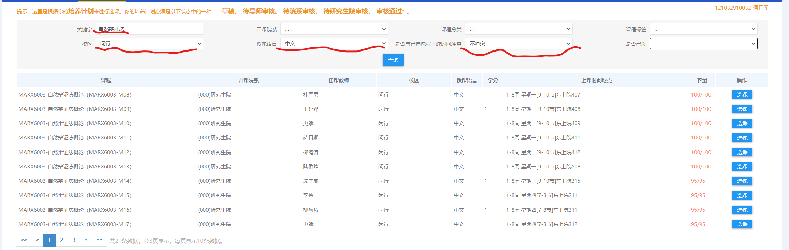
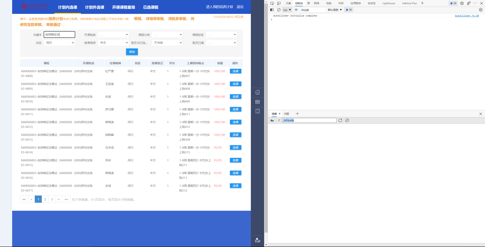

# 上海交通大学研究生系统抢课脚本

## 使用设置

在代码中开头有两个参数：

1. **ONLY_TEACHER_MODE**：取值为true/false。设置为 **true** 时，只会选择提前设置好的目标老师的课程；设置为 **false** 时，会优先选择目标老师的课程，如果目标老师均选满，则会选择其他未满老师的课程。为了保证不掉课，强烈建议设置为 **false** .
2. **TEACHER_NAME**：目标老师的名字

## 使用步骤

1. 打开选课界面，填好筛选条件后，点击查询，确保需要选择的课程会放在第一页，但最好保证第一页有课，。

   例如这里选择自然辩证法课程，校区闵行，授课语言中文，与已选课程不冲突，尽量筛选掉不相干的课程。

   

2. 按**F12**打开网页开发工具，或者**右击**页面点**检查**，在右侧弹出来的界面选择**控制台**(**Console**)。

   

3. 打开项目页面，给项目点一个star。

4. 下载addcourse.js，使用编辑器打开，修改默认参数之后，复制所有代码到控制台中，点击回车运行代码。

5. 如果顺利的话，控制台中会刷新信息，表明正在刷课。如果想要停止，在控制台中

## 注意事项

1. 强烈建议拿不相关的课程试一下选课，看看能不能跑通并成功选课。
2. 不确定长时间挂机是否需要重新登录甲亢。

## 工作原理

该脚本只是模拟人类不断点击**查询**按钮（这也是为什么第1步中需要选择好筛选条件），根据网页上的表格信息进行判断，点击选课等一系列操作。

### 本人并不太会JS，非常欢迎大佬们帮助改进、完善代码！

